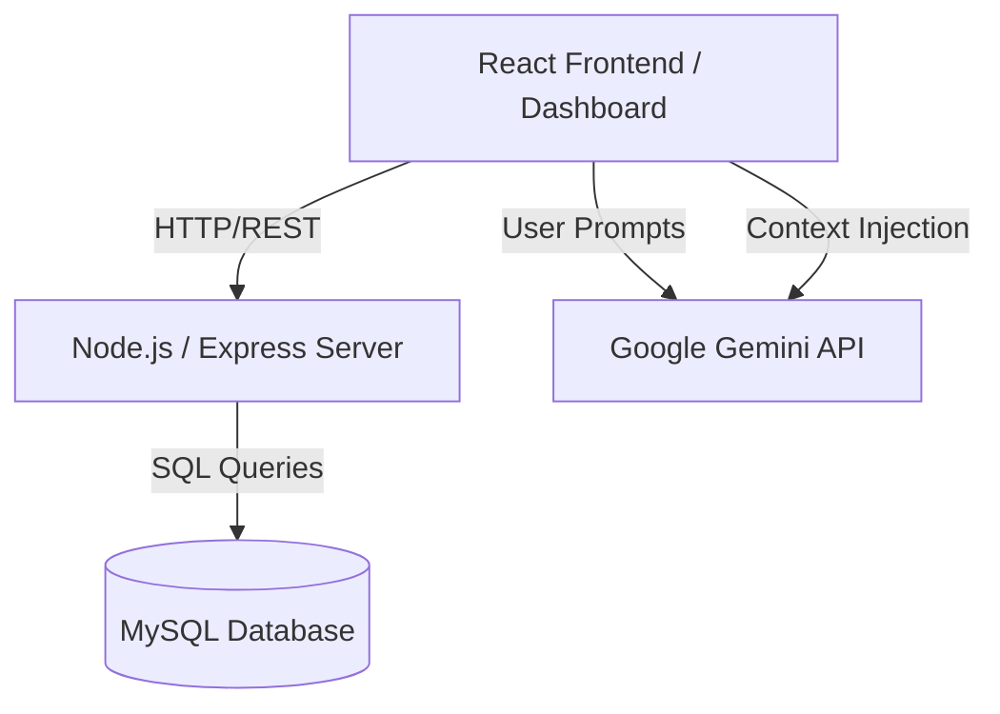
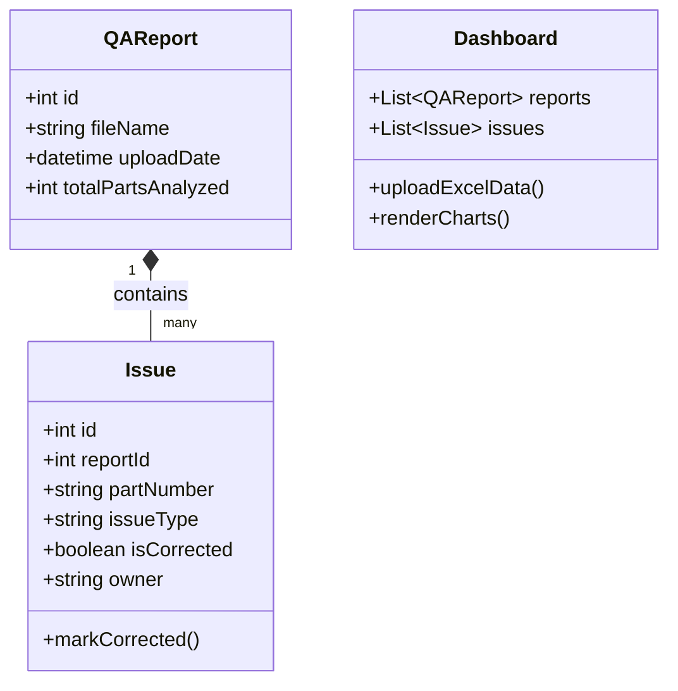

# Interview Answers: SolidWorks QA Portal - Atlas Copco

### 2. Explain your project in detail.
**Answer:** My project is the SolidWorks QA Portal, a Quality Assurance dashboard built for Atlas Copco. It's designed to streamline the management and analysis of SolidWorks part number issues. Users can upload Excel-based QA reports, and the system automatically parses and categorizes errors (like non-English characters, missing extensions, or toolbox part issues). It features a dynamic dashboard with real-time data visualization (using Chart.js/Echarts) to track issue correction rates. Additionally, I integrated an AI-powered chatbot, "Q-Bot" (using the Google Gemini API), which allows users to query their QA data using natural language, like asking "What is the status of part 12345.SLDPRT?"

### 3. Why did you choose this specific tech stack?
**Answer:** I chose **React 18** with **TypeScript** for the frontend because a complex dashboard requires a robust, componentized architecture, and TypeScript ensures strict type safety for part records. For data visualization, I used **Chart.js** and **Echarts** because they handle dynamic data rendering efficiently. The backend is **Node.js with Express**, acting as a lightweight layer to handle HTTP requests and execute database queries. For the database, I chose **MySQL** due to the structured, tabular nature of Excel QA reports. Finally, I used the **Google Gemini Pro API** because it offers an exceptionally large context window and fast inference for the chatbot.

### 4. Why did you use a relational database (MySQL) instead of NoSQL (MongoDB)?
**Answer:** The data from SolidWorks QA Excel sheets is highly structured and tabular. A relational database like MySQL is the perfect fit because there is a strict one-to-many relationship: One `Report` contains many `Issues`. We need strong ACID compliance and relational integrity to ensure that when an issue's status is toggled to "corrected," it accurately reflects against the correct historical report without data duplication. MongoDB (NoSQL) is better for unstructured, rapidly changing document structures, which isn't the case here.

### 5. Draw the High-Level Design (HLD) diagram.
*(You can draw this on a whiteboard during the interview)*


### 6. Draw the Low-Level Design (LLD) or Class Diagram.


### 7. Can you demonstrate your live-hosted project right now?
**Answer:** *(If you have it hosted, show it. If not:)* "Currently, I have it running on my local development environment using Node and MySQL. I can demonstrate it locally via `localhost:3000`. The project is fully container-ready, so hosting it on a platform like AWS EC2, Render, or Vercel would be the immediate next step for production deployment."

### 8. Show me the codebase and explain the logic for [specific feature].
**Answer:** *(If asked to explain the Chatbot/AI logic)*: I'd show them `src/services/geminiService.ts`. "The logic for the chatbot utilizes Context-Injection. Instead of just sending the user's question to Gemini, my code fetches all the open issues, corrected issues, and report summaries, and structures them into a JSON object. I inject this JSON into the `systemInstruction` of the Gemini generation call alongside strict rules (e.g., 'Never make up information'). This ensures the LLM acts purely as a data analyst on the user's specific QA data, preventing hallucinations."

### 9. What was your personal contribution versus the team's?
**Answer:** *(Adjust as needed)* "I was the primary full-stack developer on this project. I architected the database schema, built the Express.js API, designed the React frontend dashboard, parsed the Excel files, and integrated the Google Gemini AI chatbot."

### 10. What challenges did you face during this project?
**Answer:** A major challenge was giving the AI chatbot the ability to answer complex data questions accurately without hallucinating. Standard LLMs don't know about proprietary database data. I solved this by aggregating the database rows into a lightweight JSON metrics summary and injecting it into the system prompt context dynamically before every chat request. Another challenge was standardizing the data coming from varied Excel spreadsheet formats.

### 11. What are the drawbacks or flaws in your current system?
**Answer:** The current AI Chatbot injects the entire dataset summary into the LLM's prompt. While this works beautifully for hundreds of records, it won't scale if the portal accumulates hundreds of thousands of parts, as it will exceed the LLM's token limit. Additionally, the backend server uses generic `/api/query` and `update` routes that construct SQL dynamically, which could be a security risk if not strictly parameterized.

### 12. How would you improve or scale this system in the future?
**Answer:** To solve the AI token scale issue, I would implement **RAG (Retrieval-Augmented Generation)**. I would embed the issues into a vector database, so when a user asks a question, the system only fetches the top 5 most relevant records instead of thousands. For backend security and scale, I would migrate the Express SQL wrapper to a robust ORM like **Prisma** or **Sequelize** with strict schema validation.

### 13. Tell me about the work you did during your internship.
**Answer:** *(Provide your real experience here. Emphasize any work dealing with data, web logic, APIs, or database management, as it maps directly to what you built here.)*

### 14. Design a database schema for your project on paper.
**Answer:** *(Draw two simple tables)*
**Table: `reports`**
- `id` (INT, Primary Key, Auto Increment)
- `file_name` (VARCHAR)
- `uploaded_at` (DATETIME)
- `total_issues` (INT)

**Table: `issues`**
- `id` (INT, Primary Key)
- `report_id` (INT, Foreign Key -> reports.id)
- `part_number` (VARCHAR)
- `issue_type` (VARCHAR)
- `is_corrected` (BOOLEAN)
- `owner` (VARCHAR)

### 15. Explain the logic for your search bar.
**Answer:** The search functionality operates on the frontend using React state. When the user types in the search bar, it updates a `searchTerm` state. The Parts Table component applies a filter function to the array of parts (`partsData.filter(part => part.value.toLowerCase().includes(searchTerm.toLowerCase()))`). It also allows for multiple queries by splitting the search term by slashes (`/`).

### 16. Can we implement a relational database instead of NoSQL here? How?
**Answer:** *(Trap question, you ALREADY used a relational database)* "We are actually already using a relational database (MySQL). If the question is the reverse—asking if we could use NoSQL (MongoDB)—yes, we could. We would use document embedding. A single Report document would contain an array of nested Issue sub-documents. The trade-off is that updating a specific part number globally across multiple reports becomes computationally expensive."

### 17. We work in AI/ML only 1%; why do you want to join eQ if your projects are in AI/ML?
**Answer:** "While my project utilizes an AI API to enhance the user experience, building it was 99% core software engineering. I had to design schemas, build REST APIs, manage state in React, and create responsive data visualization dashboards. My passion lies in building scalable, robust enterprise software and solving complex architectural problems, which aligns perfectly with eQ's core technological focus."

### 18. Rate your skills out of 10 in C, C++, Java, and SQL.
**Answer:** *(Adjust to your reality, be honest but confident. e.g.:)*
- Java: 8/10 (My primary object-oriented language)
- SQL: 8/10 (Highly comfortable with joins, indexing, and schema design)
- C++: 7/10
- C: 6/10 

### 19. How did you design this specific webpage layout (HTML/CSS)?
**Answer:** I used a component-based approach in React, styling components with standard CSS (via `index.css`). The layout uses CSS Flexbox and Grid to align the charts into a responsive dashboard grid. I maintained a clean navigation bar component at the top to toggle between states like Dashboard, History, and Admin.

### 20. Explain the backend approach used in your project.
**Answer:** The backend is built on Express.js with the `mysql2/promise` package. Instead of hardcoding specialized routes, I built a flexible API layer with endpoints like `/api/query`, `/api/insert`, and `/api/update`. The frontend sends JSON payloads dictating the table, where-clauses, and values. The Express server safely translates this JSON into parameterized MySQL statements, mitigating SQL injection risks, and streams the JSON data back to React.

### 21. What tags did you use in your web project and why?
**Answer:** In the JSX, I used semantic HTML. For example, `<section>` for individual chart panels, `<nav>` for the navigation bar, and standard `<table>`, `<thead>`, and `<tbody>` for the Parts Table to ensure accessibility. The charts themselves are rendered onto `<canvas>` tags by the Chart.js and Echarts libraries behind the scenes.

### 22. Explain the distance calculation logic in your AI/ML project.
**Answer:** "In this particular project, I did not implement spatial distance calculations or manual vector math for the AI. Instead, I used a technique called **Prompt Context Injection**, passing the JSON data directly to the Gemini API. However, if I were using Retrieval-Augmented Generation (RAG) to scale the chatbot, I would use **Cosine Similarity** to calculate the distance between the user's query vector and the database part vectors to find the most relevant context."

### 23. Are you comfortable switching from C++ to Java (or vice versa)?
**Answer:** Absolutely. Both are strongly-typed, object-oriented languages. Once you understand core principles like polymorphism, inheritance, and memory management (whether manual in C++ or via garbage collection in Java), moving between the syntaxes is just an issue of learning the standard libraries and frameworks. 

### 24. Write a SQL query for fetching data as done in your project.
**Answer:** "To get all active issues for a specific report, categorized by issue type:"
```sql
SELECT part_number, issue_type, owner 
FROM issues 
WHERE report_id = 1 AND is_corrected = FALSE 
ORDER BY created_at DESC;
```

### 25. What was the duration and team size of this project?
**Answer:** *(Adjust to reality)* "This was developed over a period of roughly [3-4 weeks] by [just myself as a solo developer / a team of X]."

### 26. Why React?
**Answer:** Complex dashboards require a lot of reactive state—when a user clicks "Mark Corrected" on a part in the table, the backend updates, and the pie charts and bar charts must instantly re-render to reflect the new percentages. React's Virtual DOM and state management make updating these isolated UI components incredibly fast and developer-friendly compared to vanilla JavaScript.

### 27. What is the HTTPS protocol, and how do you know if a site is fake?
**Answer:** HTTPS (Hypertext Transfer Protocol Secure) is an extension of HTTP used for secure communication over a network, encrypted using Transport Layer Security (TLS/SSL). You know a site might be fake (or insecure) if the browser warns of an invalid or missing SSL certificate, if there's no padlock icon in the URL bar, or if you inspect the domain URL and see slight misspellings (e.g., `g00gle.com` instead of `google.com`).

### 28. How do you handle images in your database?
**Answer:** "The SolidWorks QA project deals strictly with tabular text data, so it doesn't store images. However, the industry standard practice for handling images is never to store them directly as BLOBs in the SQL database. Instead, you upload the image to a cloud storage bucket (like AWS S3), generate a secure URL for the file, and store that string URL in the database to be retrieved by the frontend."